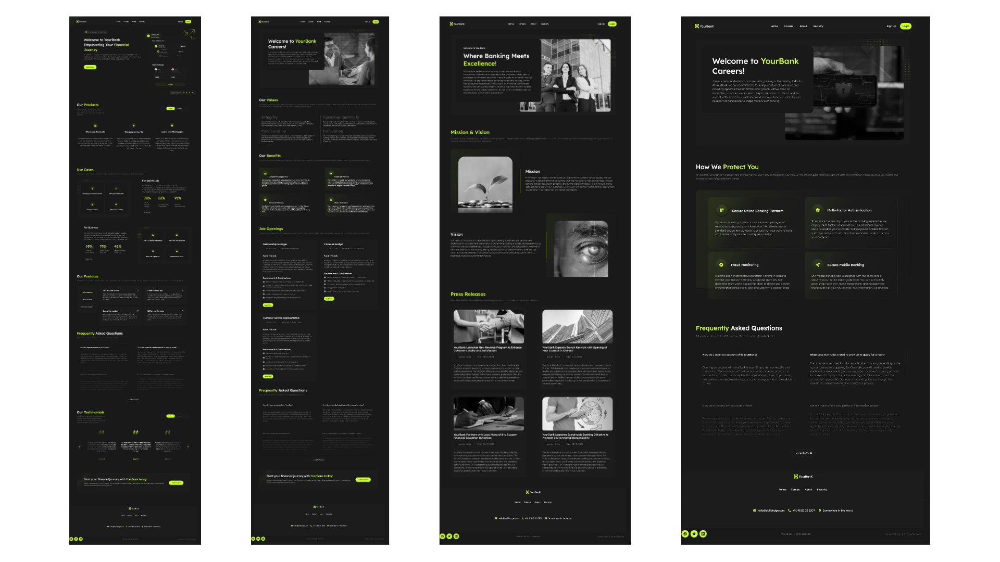
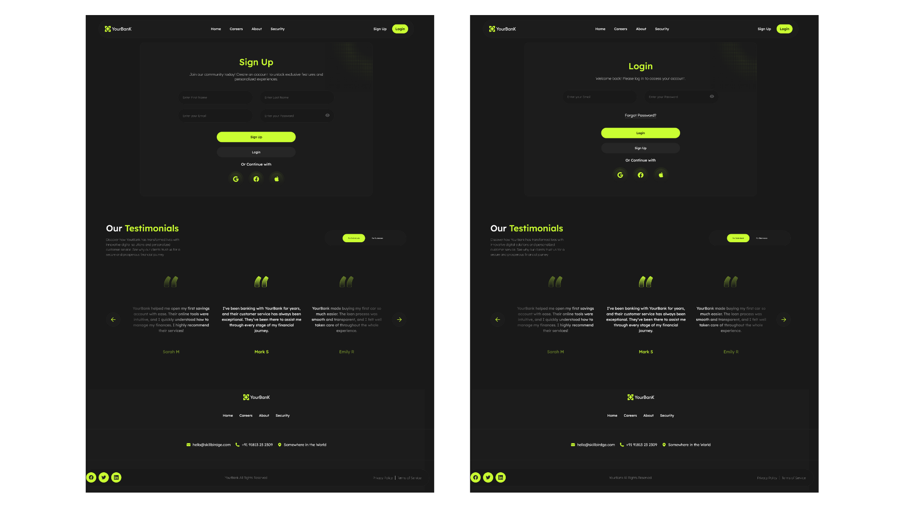

# 💳 YourBank – Multi-Page Bank Website

A responsive, modern **multi-page** banking website for a fictional bank called **YourBank**.  
This project is based on a **Figma design clone**, developed using **React** and **SCSS**, with working **login and registration functionality** using `localStorage`.

## 🎯 Project Overview

YourBank is a visually engaging and responsive banking website. It features multiple pages, reusable components, and basic authentication (login/register) handled locally. The goal was to recreate a clean, component-based UI from Figma and implement user interactions for a realistic prototype.

## 🛠️ Technologies Used

- **React** – Frontend framework
- **SCSS** – Styling with modular SCSS structure
- **React Router** – Client-side routing for multiple pages
- **LocalStorage** – Used for user authentication (login & registration)
- **Figma** – Source design

## 📄 Pages

- **Home Page**
- **Careers Page**
- **About Page**
- **Security Page**
- **SignUp Page**
- **Login Page**

> Authentication pages (Login/Register) store user data in `localStorage` for demo purposes.

## ✨ Features

- 🔁 Reusable, clean React components
- 🎞️ Custom slider elements
- 🖼️ Based on a modern Figma design
- 📱 Fully responsive (mobile, tablet, desktop)
- 👥 Functional login & register flow using `localStorage`
- 🔐 Basic routing with protected route support potential

## 📸 Screenshots




## 🚀 Getting Started

1.  **Clone the repository:**
    ```bash
    git clone https://github.com/Ignaulis/yourbank_app.git
    ```
2.  **Install dependencies:**
    ```bash
    npm install
    # or
    yarn install
    ```
3.  **Run:**
    ```bash
    npm start
    # or
    yarn start
    ```

## 📚 License

```text
This project is open-source and free to use.
